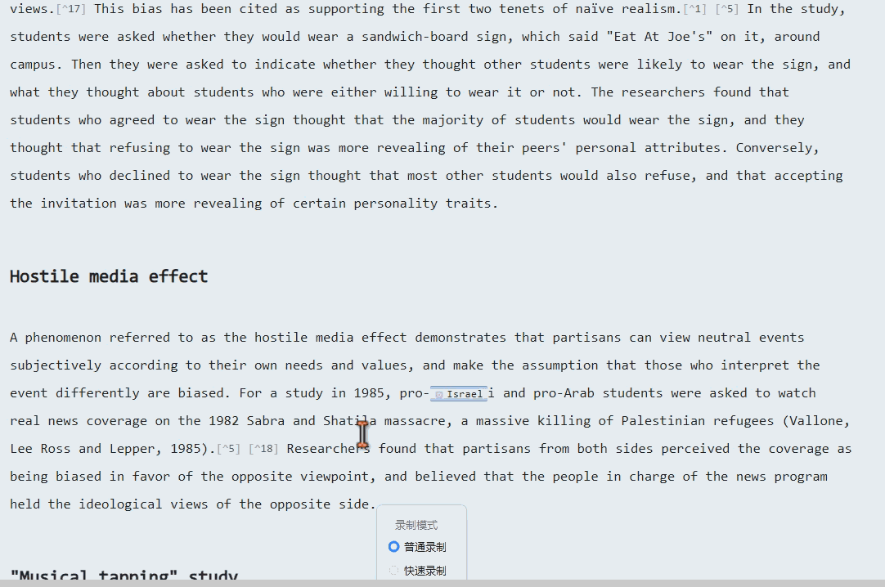
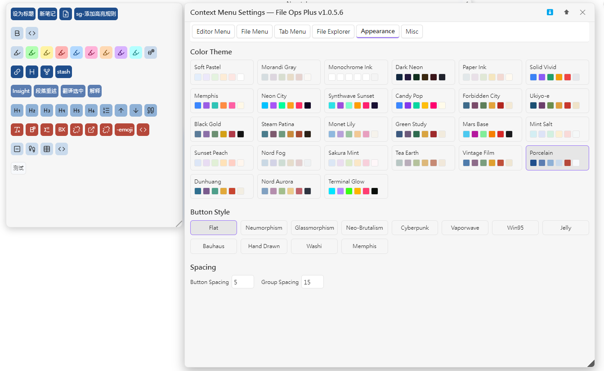
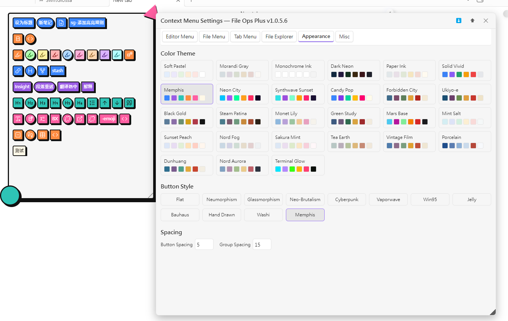
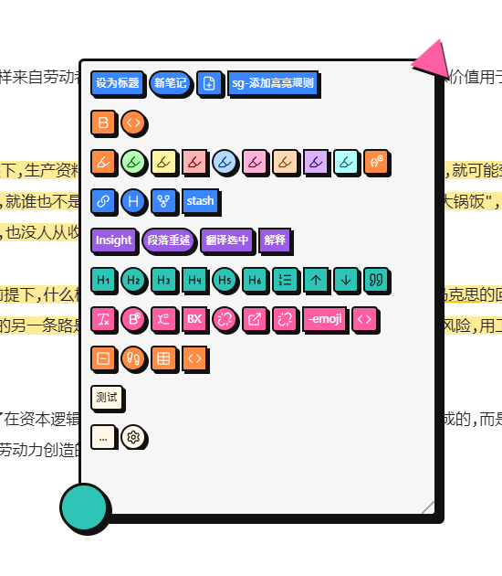

# File Ops Plus

Obsidian 文件操作增强插件，为文件管理器、标签页、编辑器提供可配置的图标化右键菜单，支持 27 套配色 × 12 套风格外观自定义、AI 处理选中文本、暂存面板等功能。

> An Obsidian plugin providing configurable icon-based context menus for the file explorer, tab headers, and editor, with 27 color themes × 12 button styles, AI text processing, and a stash panel.

## 外观自定义 / Appearance Customization

- **27 套配色方案**：柔彩粉彩、莫兰迪灰调、深色霓虹、孟菲斯、霓虹夜城、合成波日落、故宫红墙、浮世绘、黑金暗房、莫奈睡莲、青花瓷、敦煌矿彩、Nord极光、终端荧光等
- **12 套按钮风格**：扁平、新拟态、玻璃拟态、新粗野、赛博朋克、蒸汽波、Win95、果冻、包豪斯、手绘、和纸、孟菲斯
- **间距可调**：按钮间距、分组间距数值自定义
- 设置面板左侧实时预览，点击卡片即时切换

> - **27 color themes**: Soft Pastel, Morandi Gray, Dark Neon, Memphis, Neon City, Synthwave Sunset, Forbidden City, Ukiyo-e, Black Gold, Monet Lily, Porcelain, Dunhuang, Nord Aurora, Terminal Glow, etc.
> - **12 button styles**: Flat, Neumorphism, Glassmorphism, Neo-Brutalism, Cyberpunk, Vaporwave, Win95, Jelly, Bauhaus, Hand Drawn, Washi, Memphis
> - **Adjustable spacing**: Custom button and group spacing
> - Live preview; click cards to switch instantly

## 编辑器右键菜单 / Editor Context Menu

在 Markdown 源码模式下拦截右键，展示分组化图标菜单。支持 7 种选项类型：

> Intercepts right-click in Markdown source mode to show a grouped icon menu with 7 option types:

| 类型 | 说明 |
|------|------|
| **cmd** | 下拉选择 Obsidian 命令 |
| **regex** | 正则匹配 + 替换 |
| **custom** | 预设转换（toggleHeading、toggleChecklist、fullwidthToHalf 等） |
| **pipeline** | 链式执行多个 transform，用 `→` 分隔 |
| **action** | 复制块引用 / 提取为新笔记 / 复制标题链接 / 设为文档标题 |
| **keystroke** | 录制并回放键盘快捷键 |
| **ai** | 选中文本发送给 AI，结果在悬浮面板展示 |

> | Type | Description |
> |------|-------------|
> | **cmd** | Dropdown to select an Obsidian command |
> | **regex** | Regex match + replace |
> | **custom** | Preset transforms (toggleHeading, toggleChecklist, fullwidthToHalf, etc.) |
> | **pipeline** | Chain transforms with `→` separator |
> | **action** | Copy block ref / Extract to new note / Copy heading link / Set as title |
> | **keystroke** | Record and replay keyboard shortcuts |
> | **ai** | Send selected text to AI, display result in floating panel |

### 局部关系列表 & 暂存面板 / Local Relation List & Stash Panel

- **局部关系列表**：展示当前文档的提及/被提及文档，点击跳转
- **暂存面板**：暂存选中文本或剪贴板内容，点击插入到光标位置；手风琴悬停展开，支持清空
- 两个面板均吸附在菜单旁，可拖动脱离、Ctrl+滚轮调透明度、右下角拖拽调整大小

> - **Local relation list**: Shows mentioning/mentioned-by docs of the current note, click to navigate
> - **Stash panel**: Stash selected text or clipboard content, click to insert at cursor; accordion hover-expand, supports clear-all
> - Both panels dock beside the menu, can be undocked, Ctrl+wheel for opacity, bottom-right drag to resize

### AI 结果面板 / AI Result Panel

- AI 返回内容用非模态悬浮面板展示，Markdown 渲染
- 底部三按钮：复制 / 插入到光标 / 替换选中文本
- AI 配置：model / base_url / apiKey / temperature（OpenAI 兼容 API）

> - Non-modal floating panel with Markdown rendering
> - Three buttons: Copy / Insert at cursor / Replace selection
> - Config: model / base_url / apiKey / temperature (OpenAI-compatible API)

### 选中文本悬浮球 / Selection Hover Ball

- 选中文本后选区右上角显示悬浮球，悬停即展开编辑器增强菜单

> - Hover ball appears at selection top-right; hover to expand the editor menu

## 文件 & 标签页菜单 / File & Tab Menus

- 将原生右键菜单替换为可配置的图标化分组菜单
- **文件名着色**：自定义颜色标签 + 加粗，在文件管理器中着色显示
- **移动到…**：两步式选择目标文件夹
- 所有菜单均可拖动定位，`...` 按钮可回退到原生菜单

> - Replaces native context menus with configurable icon-based grouped menus
> - **Filename coloring**: Custom color labels + bold, displayed in file explorer
> - **Move to…**: Two-step target folder selection
> - All menus draggable; `...` button falls back to native menu

## 设置面板 / Settings Panel

- 六个标签页：编辑器菜单 / 文件菜单 / 标签页菜单 / 文件管理器 / 外观 / 杂项
- 左侧实时预览，右侧配置区
- 分组增删/改名/配色/拖拽排序，选项增删/拖拽排序
- 导入/导出设置 JSON，折叠/展开分组

> - Six tabs: Editor Menu / File Menu / Tab Menu / File Explorer / Appearance / Misc
> - Left: live preview; right: configuration
> - Group add/remove/rename/color/drag-reorder, option add/remove/drag-reorder
> - Import/export settings JSON, collapsible groups

## 安装 / Installation

将 `main.js`、`manifest.json`、`styles.css` 放入 `.obsidian/plugins/file-ops-plus/`，在设置 → 第三方插件中启用。

> Place `main.js`, `manifest.json`, `styles.css` into `.obsidian/plugins/file-ops-plus/`, enable in Settings → Community Plugins.

## 兼容性 / Compatibility

- 最低 Obsidian 版本：1.2.7 | 仅桌面端 | 中/英文 i18n

> - Min Obsidian: 1.2.7 | Desktop only | CN/EN i18n
