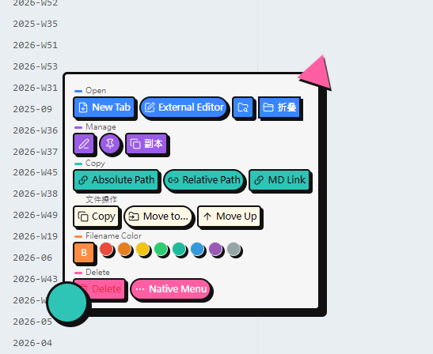
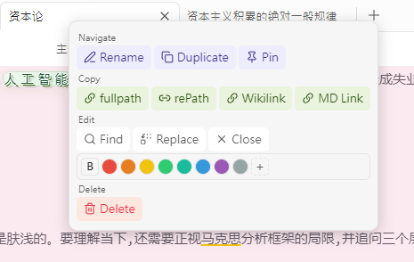
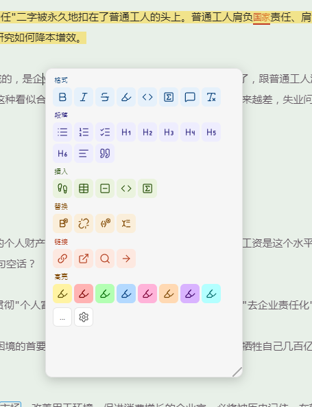
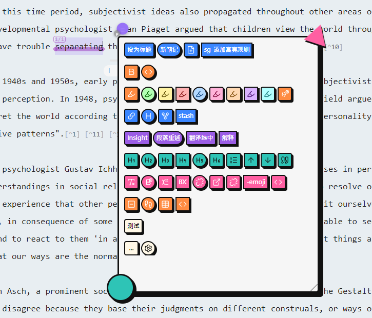
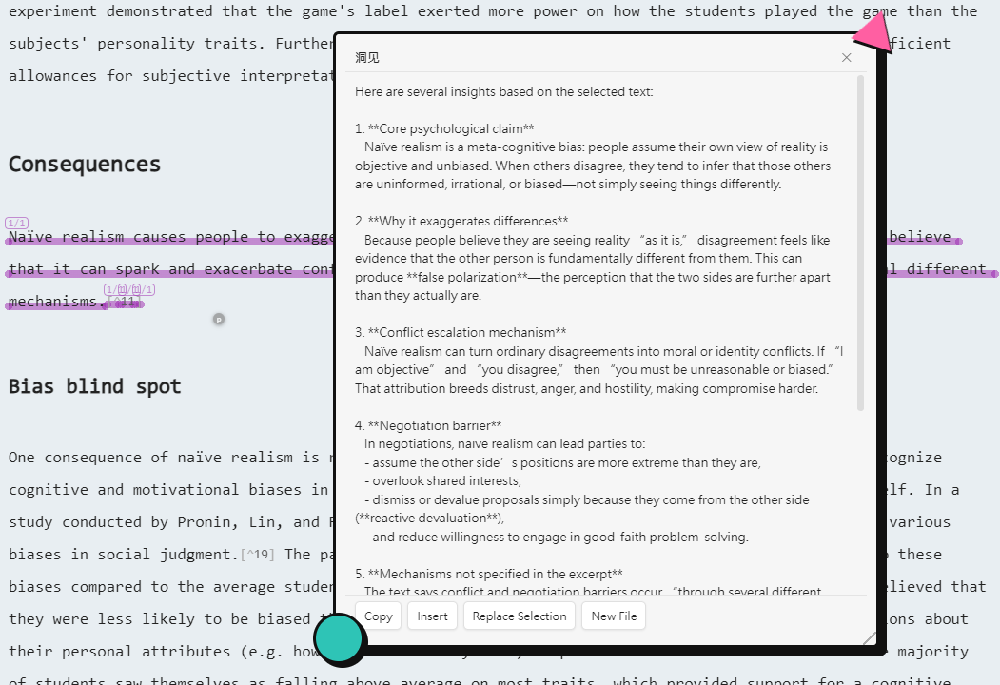
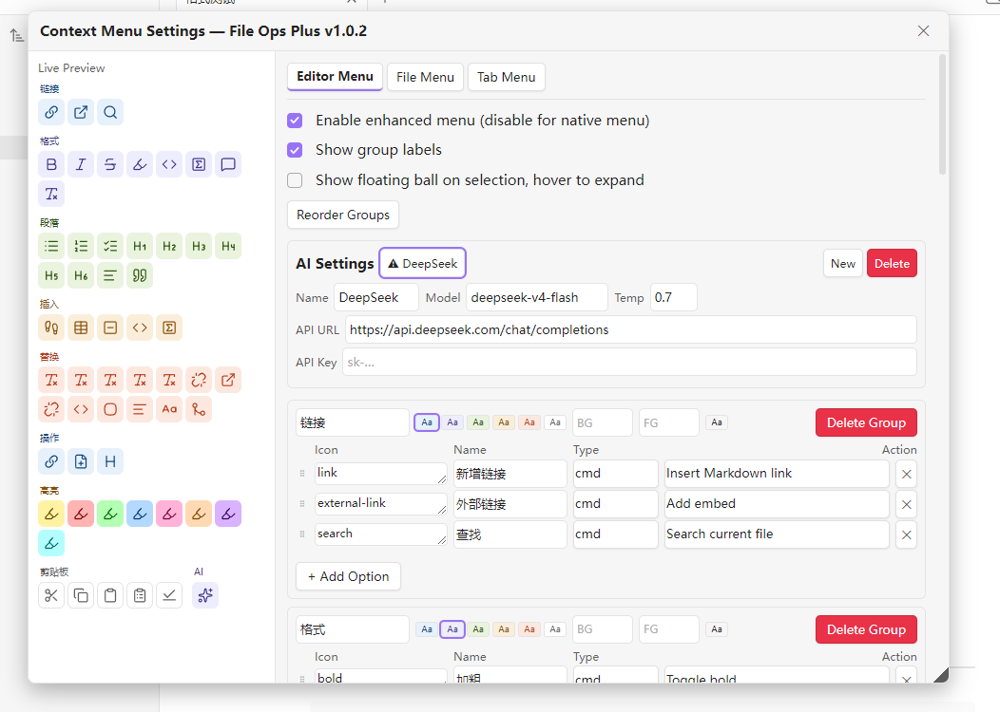

# File Ops Plus

Obsidian 文件操作增强插件，为文件管理器、标签页、编辑器提供自定义右键菜单，支持菜单配置化、AI 处理选中文本、悬浮球触发等功能。

> An Obsidian plugin that enhances context menus for the file explorer, tab headers, and editor, with configurable menus, AI text processing, and a selection hover ball.

## 功能概览 / Feature Overview

### 文件管理器右键菜单 / File Explorer Context Menu

- **打开方式**：新标签页 / 新窗口 / 默认应用 / 外部编辑器 / 资源管理器中显示
- **文件操作**：重命名（行内编辑）/ 创建副本 / 置顶 / 删除（脉冲倒计时确认）
- **复制链接**：绝对路径 / 相对路径 / wikilink / Markdown 链接
- **批量操作**：复制到系统剪贴板 / 文件上移（移到上一级目录）/ 移动到…（两步式选择目标文件夹）
- **颜色标记**：可增删自定义颜色标签 + 加粗，文件名着色显示
- **新建**：行内新建文件 / 文件夹
- **启用/关闭编辑器增强菜单**：快捷开关
- 每个选项显示图标 + 文字，按功能横排分组，支持分组标题显示

> - **Open with**: New tab / new window / default app / external editor / reveal in explorer
> - **File ops**: Rename (inline) / duplicate / pin / delete (pulse countdown confirmation)
> - **Copy link**: Absolute path / relative path / wikilink / Markdown link
> - **Batch ops**: Copy to clipboard / move up (to parent folder) / move to… (two-step target selection)
> - **Color tag**: Customizable color labels + bold, file name colored display
> - **Create**: Inline new file / folder
> - **Enable/disable editor enhanced menu**: Quick toggle
> - Each option shows icon + text, grouped horizontally by function, with optional group labels

### 标签页右键菜单 / Tab Header Context Menu

- 关闭 / 关闭其他 / 关闭右侧 / 全部关闭
- 锁定 / 取消锁定
- 阅读/源码切换、左右分屏、上下分屏、新窗口
- 默认应用打开、外部编辑器、资源管理器
- 局部图、反链、出链、大纲
- 重命名、创建副本、置顶
- 绝对路径 / 相对路径 / wikilink / MD 链接 / 复制 / 文件上移 / 移动到…
- 查找、替换、导出 PDF
- 颜色标记、删除
- 每个选项显示图标 + 文字，按功能横排分组，支持分组标题显示

> - Close / close others / close right / close all
> - Pin / unpin
> - Reading/source toggle, split vertical, split horizontal, new window
> - Default app, external editor, reveal in explorer
> - Local graph, backlinks, outgoing links, outline
> - Rename, duplicate, pin
> - Absolute path / relative path / wikilink / MD link / copy / move up / move to…
> - Find, replace, export PDF
> - Color tag, delete
> - Each option shows icon + text, grouped horizontally by function, with optional group labels

### 编辑器右键菜单 / Editor Context Menu

在 Markdown 源码模式下拦截右键，展示分组化图标菜单：

> Intercepts right-click in Markdown source mode to show a grouped icon menu:

- **链接**：新增链接、外部链接、查找
- **格式**：加粗、倾斜、删除线、高亮、代码、数学、注释、清除格式
- **段落**：无序列表、有序列表、任务列表、H1-H6、正文、引用
- **插入**：脚注、表格、分隔线、代码块、数学块
- **替换**：移除加粗/倾斜/删除线/高亮/行内代码、链接留文本/URL、wiki 留文本、去 HTML 标签、合并空行、去行首空白、全角转半角
- **高亮**：8 色 mark 高亮（黄红绿蓝粉橙紫青）
- **更多**（`...`）：展开 Obsidian 原生菜单
- **设置**（⚙）：打开设置面板

> - **Link**: Insert link, embed, find
> - **Format**: Bold, italic, strikethrough, highlight, code, math, comment, clear formatting
> - **Paragraph**: Bullet list, numbered list, checklist, H1-H6, normal text, quote
> - **Insert**: Footnote, table, horizontal rule, code block, math block
> - **Replace**: Remove bold/italic/strikethrough/highlight/inline code, link to text/URL, wiki to text, strip HTML, merge blank lines, trim leading space, fullwidth to half
> - **Highlight**: 8-color mark highlight (yellow/red/green/blue/pink/orange/purple/cyan)
> - **More** (`...`): Expand Obsidian native menu
> - **Settings** (⚙): Open settings panel

#### 选项类型 / Option Types

| 类型 | 说明 |
|------|------|
| **cmd** | 下拉选择 Obsidian 命令（自动枚举所有可用命令） |
| **regex** | 正则匹配 + 替换，支持标志 g/i/m/s/u/y |
| **custom** | 预设转换（toggleHeading1-6 / toggleChecklist / toggleParagraph / toggleCodeblock / toggleMathblock / fullwidthToHalf） |
| **pipeline** | 链式执行多个 transform，用 `→` 分隔（如 `去HTML标签→合并空行`），Tab 键插入 `→` |
| **action** | 内置动作：复制块引用 / 提取为新笔记 / 复制标题链接 / 选中文本设为文档标题 |
| **keystroke** | 录制并回放键盘快捷键，支持修饰键，常用快捷键映射到编辑器 API |
| **ai** | AI Prompt — 选中文本发送给 AI 处理，结果在悬浮面板展示 |

> | Type | Description |
> |------|-------------|
> | **cmd** | Dropdown to select an Obsidian command (auto-enumerates all available commands) |
> | **regex** | Regex match + replace, supports flags g/i/m/s/u/y |
> | **custom** | Preset transforms (toggleHeading1-6 / toggleChecklist / toggleParagraph / toggleCodeblock / toggleMathblock / fullwidthToHalf) |
> | **pipeline** | Chain multiple transforms with `→` separator (e.g. `Strip HTML→Merge Blank Lines`), Tab inserts `→` |
> | **action** | Built-in actions: Copy block ref / Extract to new note / Copy heading link / Set selection as title |
> | **keystroke** | Record and replay keyboard shortcuts, supports modifiers, common shortcuts mapped to editor API |
> | **ai** | AI Prompt — Send selected text to AI, display result in floating panel |

### 选中文本悬浮球 / Selection Hover Ball

- 在编辑器中选中文本后，选区右上角显示悬浮球
- 鼠标悬停悬浮球即展开编辑器增强菜单
- 同时保留原生右键菜单

> - After selecting text in the editor, a hover ball appears at the top-right of the selection
> - Hovering over the ball expands the editor enhanced menu
> - Native right-click menu is preserved

### AI 结果悬浮面板 / AI Result Floating Panel

- AI 返回内容用非模态悬浮面板展示，Markdown 渲染
- 面板可拖动，Esc 或 ✕ 关闭
- 底部三按钮：复制 / 插入到光标 / 替换选中文本
- AI 设置：name / model / base_url / apiKey / temperature（OpenAI 兼容 API）

> - AI response is shown in a non-modal floating panel with Markdown rendering
> - Panel is draggable, closable via Esc or ✕
> - Three bottom buttons: Copy / Insert at cursor / Replace selection
> - AI config: name / model / base_url / apiKey / temperature (OpenAI-compatible API)

### 设置面板 / Settings Panel

- 标题显示插件名称和版本号
- 三个标签页：**编辑器菜单** / **文件菜单** / **标签页菜单**
- 左侧实时预览区，右侧配置区
- 启用/关闭增强菜单、显示/隐藏分组标题
- 分组增删、改名、配色（6 种预设色 + 自定义）
- 分组拖拽整体排序（移动时折叠显示）
- 选项增删、拖拽排序
- 每个选项可配置：图标（lucide 名）、名称、action（下拉选择）
- 颜色标记平铺显示，支持添加/删除自定义颜色
- 面板可拖动、可调整大小，位置和尺寸持久化
- 恢复默认按钮位于底部靠右

> - Title shows plugin name and version
> - Three tabs: **Editor Menu** / **File Menu** / **Tab Menu**
> - Left: live preview area; right: configuration area
> - Enable/disable enhanced menu, show/hide group labels
> - Add/remove groups, rename, color (6 presets + custom)
> - Drag groups to reorder (collapses during drag)
> - Add/remove options, drag to reorder
> - Each option: icon (lucide name), label, action (dropdown selection)
> - Color tags displayed inline, supports add/remove custom colors
> - Panel is draggable, resizable; position and size are persisted
> - Reset to default button at bottom-right

### 其他功能 / Other Features

- **外部编辑器**：自动检测 VS Code / Typora / Notepad++ / Sublime Text，无默认时弹输入框手动指定路径
- **国际化**：根据 `moment.locale()` 自动切换中/英文
- **置顶**：CSS order 排序，不移动 DOM，兼容 React 虚拟 DOM
- **删除**：单个文件用 7 秒脉冲倒计时按钮，多文件弹确认对话框，支持撤销恢复
- **菜单拖动**：所有自定义菜单空白部分可拖动定位

> - **External editor**: Auto-detects VS Code / Typora / Notepad++ / Sublime Text; prompts for path if none found
> - **i18n**: Auto-switches Chinese/English based on `moment.locale()`
> - **Pin**: CSS order sorting, no DOM movement, compatible with React virtual DOM
> - **Delete**: 7-second pulse countdown button for single file, confirmation dialog for multiple files, with undo
> - **Menu drag**: All custom menus can be dragged by their blank area

## 安装 / Installation

将 `main.js`、`manifest.json`、`styles.css` 放入 `.obsidian/plugins/file-ops-plus/` 目录，在 Obsidian 设置 → 第三方插件中启用。

> Place `main.js`, `manifest.json`, `styles.css` into `.obsidian/plugins/file-ops-plus/`, then enable in Obsidian Settings → Community Plugins.

## 命令面板 / Command Palette

- `Context Menu Settings` — 打开右键菜单设置面板（可在增强菜单关闭后重新启用）

> - `Context Menu Settings` — Open the context menu settings panel (can re-enable after disabling the enhanced menu)

## 兼容性 / Compatibility

- 最低 Obsidian 版本：1.2.7
- 仅桌面端
- Windows 原生菜单不支持的 DOM 操作已用自定义菜单替代

> - Minimum Obsidian version: 1.2.7
> - Desktop only
> - Windows native menu DOM limitations handled with custom menu replacement
